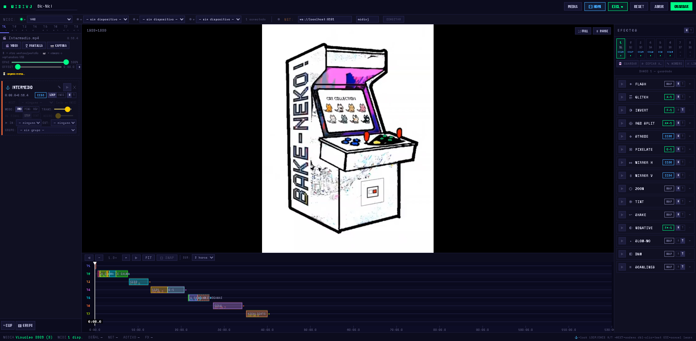
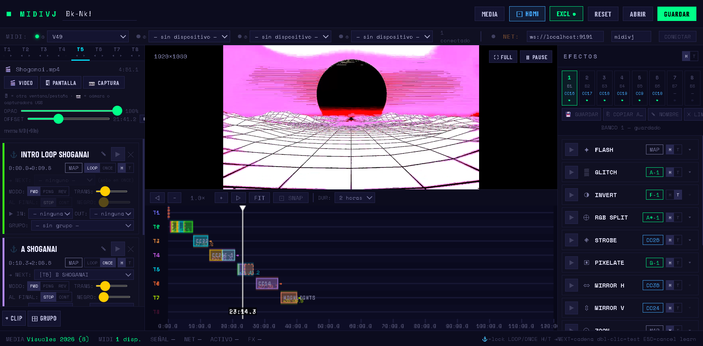

# MIDIVJ

Aplicación local de visuales en vivo controlada por MIDI. El runtime vive en `src/`, las sesiones `.vjp` en `Sessions/` y los medios locales en `videos/Visuales 2026/`.




## Ejecutar

En Windows, inicia `src/INICIAR_RELAY.bat`. En macOS, `src/INICIAR_RELAY.command` (doble clic; la primera vez puede pedir `chmod +x`). Los dos launchers usan la raíz real del proyecto e instalan la versión fijada de `ws` si falta. El relay **abre solo el navegador** con la aplicación, así que no hay que copiar ninguna dirección:

- Aplicación principal: `http://localhost:9191/`
- Emisor MIDI: `http://localhost:9191/sender`
- Control remoto (QR de conexión): `http://localhost:9191/control`
- Mando móvil: `http://localhost:9191/mando`

> **Macs viejos.** En un Mac anterior a macOS 11 (por ejemplo una MacBook Pro de 2012, que llega hasta Catalina 10.15) instala **Node 16**: [node-v16.20.2.pkg](https://nodejs.org/dist/v16.20.2/node-v16.20.2.pkg). Las versiones nuevas de Node se instalan sin avisar y al arrancar mueren con `dyld: Symbol not found`. El launcher `.command` detecta ese caso y lo dice.

Si el puerto 9191 está ocupado (por ejemplo, un relay que quedó abierto), el relay **prueba los siguientes** hasta el 9200 y anuncia el que eligió. La aplicación se conecta sola al relay que la sirvió, así que el cambio de puerto no rompe nada: no hace falta tocar el campo `NET`. Si la conexión se cae, la aplicación reintenta sola; **DESCONECTAR** la deja apagada a propósito.

También puedes ejecutar el relay manualmente desde la raíz:

```powershell
node .\src\midivj-relay.js
```

Acepta un puerto y `--sin-navegador` si prefieres abrir la página tú:

```powershell
node .\src\midivj-relay.js 9300 --sin-navegador
```

El botón **GUARDAR** envía la sesión al relay local. El servidor valida el nombre y crea un archivo nuevo dentro de `Sessions/`; nunca guarda sesiones en Descargas ni sobrescribe una existente. Los videos permanecen fuera de Git mediante `.gitignore`.

## Como usarlo

### MIDI

en la barra superior tienes la posibilidad de agregar hasta 4 controladores MIDI conectados a tu computadora, pero también tienes la posibilidad de recibir mediante Websocket MIDI desde otra computadora para mapear los tres elementos principales del programa mediante mensajes CC y Notas: CLIPS, EFECTOS y BANCOS.

### Videos

Para configurar tus visuales dirigete a la ventana lateral izquierda donde tendrás ocho Tracks de videos (T1...T8) donde podrás elegir tres opciones para tus visuales: VIDEO (archivo), PANTALLA, CAPTURADORA de video. Una vez agregado Crea un CLIP en la parte inferior de la misma ventana y ahora podrás asignale un mensaje MIDI de CC o de Nota para disparar el CLIP.

### CLIPS

Los CLIPS cuentan con las siguientes funciones que sirven para personalizar la ejecución de tus visuales:

- MAP: Mapeas el mensaje MIDI que quieres asignar para ejecutar el CLIP.
- LOOP: El CLIP Entrará en Loop, por lo que una vez finalice el CLIP regresa desde el inicio.
- ONCE: El CLIP Entrará en Once, por lo que una vez finalice el CLIP este termina, pero con la posibilidad de usar la función "NEXT".
- NEXT: Esta función permite que el CLIP se dirija a otro CLIP dentro o fuera del mismo TRACK, permitiendo brincar entre videos o CLIPS.
- MODOS: Dentro del LOOP sirven para que el video vaya hacia delante, de reversa o en ping/pong (todavía en pruebas)
- IN/OUT: Sirve para añadir a los CLIPS un Fade IN y/o Fade OUT.
- TRANS: Es para suavizar las transiciones entre CLIPS,
- GRUPOS: Permite agrupar CLIPS en grupos con la finalidad de tener una mejor organización, para esto tienes que crear los grupos que utilizarás y alojar los CLIPS en ese espacio. Ejemplo: Verso - 2 CLIPS | Coro - 3 CLIPS | Outro - 2 CLIPS

### TRACK VIEWER

Es la Ventana inferior central, tienes la posibilidad de observar todos tus tracks, desplazarte, zoom in/out y puedes observar el cursor que te indica la posición de todo el video.

### BANCOS

Permiten guardar el estado de tu sesión para facilitar la reutilización de mensajes MIDI que planeas configurar, pudiendo de esta manera crear PRESETS por canciones tanto de CLIPS, como de EFECTOS o de los mismos BANCOS.

### EFECTOS

Son una lista variada de efectos de video de bajo consumo para modificar el resultado final de tus visuales.

## Control remoto: el celular como mando

Con el relay corriendo, hasta **cuatro teléfonos** pueden disparar tus visuales desde la misma red. El mando envía mensajes MIDI normales, así que **todo lo que puedas mapear con MIDI en MIDIVJ se puede poner en un botón del teléfono**, y el `MAP` de la aplicación aprende tocando un botón del celular igual que con un controlador físico.

### Conectar

1. Inicia `src/INICIAR_RELAY.bat` (o `src/INICIAR_RELAY.command` en macOS). Se abre la aplicación y **se conecta sola** al relay (sala `midivj`).
2. Pulsa **📡 RELAY** en el encabezado (entre `⊡ HDMI` y `EXCL`). Ese botón abre el panel de relay y mandos, y lleva el contador de teléfonos conectados: se pone verde cuando hay alguno.
3. En el panel, **📱 ABRIR QR DE MANDOS**. En el teléfono, escanea el QR del **Mando 1** (hay uno por dispositivo). Si la computadora tiene varias direcciones IP, elige arriba cuál usar.

### El panel de relay

Todo lo del relay se maneja desde ahí, sin buscar en la barra de estado:

- **Estado** — si hay relay, a qué dirección y sala; si no, que no lo hay.
- **1 · Iniciar el relay** — sólo aparece cuando falta. Trae la ruta del `.bat` y el comando, con botón para copiarlos, porque una página web no puede arrancar un proceso: el relay se inicia fuera del navegador. **🔍 BUSCAR RELAY** revisa los puertos 9191 a 9200 y se conecta al que encuentre (útil si el relay tomó otro puerto). Si abriste el HTML con doble clic, ofrece el enlace para abrir MIDIVJ desde el relay, que es como conviene usarlo.
- **2 · Conexión** — dirección y sala. Sólo hay que tocarlo para usar el relay de **otra** computadora.
- **3 · Teléfonos** — abre los QR y lista los mandos conectados.

Si al abrir MIDIVJ no hay relay, el panel **se abre solo** a los pocos segundos.

La página de control genera los QR **en local**, sin internet: sirve igual en una red sin salida a internet.

### Red creada por la computadora

Si no hay router, comparte la red desde Windows (Configuración → Red e Internet → Zona con cobertura inalámbrica móvil) o con `netsh wlan start hostednetwork` desde una consola de administrador. El adaptador virtual toma `192.168.137.1`: esa dirección aparece marcada como **hotspot** y encabeza la lista, porque es la que alcanzan los teléfonos unidos a esa red.

**La red se detecta sola**, en este orden: punto de acceso móvil encendido → `hostednetwork` iniciada → Wi-Fi a la que está conectada la computadora. De cada una se leen SSID y contraseña y se arma el QR para unirse con la cámara. Del punto de acceso móvil se leen aunque esté **apagado**: el QR queda listo y la página avisa que falta encenderlo. Sólo si Windows no reporta nada hay que escribir SSID y contraseña a mano en la página de control.

Todas esas consultas son de lectura (`netsh` y la API de Windows); el programa nunca enciende, apaga ni cambia una red por su cuenta.

Si el teléfono no abre la página, casi siempre es el firewall: la página de control muestra la regla exacta (`netsh advfirewall …`, sólo perfil privado). El relay es de red local; no lo expongas a internet.

### Mapear los botones con MAP

Cada botón del mando **nace con su propio mensaje MIDI libre** (nota 0, 1, 2… sin repetir y sin chocar con lo que ya usan tus clips, efectos y bancos). Por eso se mapea igual que un controlador físico:

1. En el mando, pulsa **🎯 MAPEAR**. En ese modo, tocar un botón sólo manda su mensaje: no salta de grupo ni se queda encendido, y cada botón muestra su número.
2. En MIDIVJ, pulsa **MAP** en el clip o el efecto (o **Asignar** en el banco). Aparece el aviso `● MIDI LEARN`.
3. Toca el botón en el teléfono. Queda mapeado; la pastilla del clip pasa a mostrar la nota.
4. Repite con los demás y sal de **🎯 MAPEAR**.

Funciona con todo lo que MIDIVJ ya sabe mapear: **clips**, **efectos** y **bancos**. Después, **✨ SUGERIR** en el inspector del botón le pone de etiqueta el nombre de lo que quedó mapeado.

MAP acepta las tres fuentes y las distingue en la pastilla:

| Fuente | Pastilla | Color |
| --- | --- | --- |
| Nota de un controlador | `C3`, `F#2`… | verde |
| CC de un controlador | `CC20` | azul |
| Botón de un mando | `M1·CORO` (mando y etiqueta del botón; si no tiene, su fila y columna) | amarillo |

El globo de ayuda de la pastilla siempre dice el mensaje real, así que puedes ver la nota exacta de un mapeo hecho desde el teléfono. La procedencia se guarda en la sesión `.vjp`.

Si prefieres el camino inverso —elegir el destino desde el teléfono— usa **DESTINO EN MIDIVJ** en el inspector: lista los clips, efectos y bancos con su mensaje y copia el que ya tengan asignado.

En el inspector, **🎲 LIBRE** toma un mensaje que no use ningún otro botón, y aparece un aviso en rojo si dos botones se pisan (MIDIVJ no distingue el canal: mismo tipo y número = mismo disparo).

### Personalizar los botones

En el mando, **✎ EDITAR** abre la barra de personalización:

- **Cuadrícula n×m** — filas y columnas, separación, radio, tamaño de texto y tema claro/oscuro.
- **Grupos** — cada pestaña es un grupo (por ejemplo `CLIPS`, `CORO`, `EFECTOS LENTOS`). Se crean, renombran y borran desde esa misma barra.
- **Botón** — al tocarlo en modo edición se abre su inspector: etiqueta, colores de fondo/texto/borde, forma (recto, redondeado, pastilla, círculo), brillo, tamaño en celdas (un botón puede ocupar varias), animación (pulso, latido, giro, parpadeo, onda) e **imagen o GIF** de fondo.
- **Texto sugerido** — el desplegable **DESTINO EN MIDIVJ** lista los clips, efectos y bancos de la sesión con su mensaje MIDI (`●` ya mapeado, `○` sin mapear): al elegir uno se rellena el mensaje y se propone su nombre como etiqueta. **✨ SUGERIR** hace lo mismo a partir del mensaje que ya tenga el botón.
- **Mensaje** — nota o CC, número, canal y modo: `Pulso` (on+off, ideal para lanzar clips), `Mantener` (mientras lo pisas, para efectos en HOLD) o `Alternar`. Normalmente no hay que tocarlo: el botón ya trae uno libre.

El layout es único y compartido: se edita desde cualquier dispositivo y el relay lo reparte al resto al instante. Se guarda en `data/mando-layout.json` (fuera de Git; cópialo si quieres respaldarlo).

### Submenús de efectos por clip

Un botón principal puede **alojar un grupo de efectos**: en su inspector, elige el grupo en *AL DISPARAR, ABRIR*. Al pulsarlo, el botón lanza su clip y ese teléfono salta al grupo de efectos.

El regreso al menú principal se elige en *VOLVER*:

- **al terminar el clip** — MIDIVJ avisa cuando el clip que lanzó ese botón deja de estar activo: al acabar un `ONCE`, al encadenar con `NEXT`, al detenerlo o al reemplazarlo por otro clip de la misma pista. Ojo: un clip en `LOOP` no termina solo, así que ahí conviene usar el retorno por tiempo o a mano.
- **a los N segundos** — temporizador.
- **sólo a mano** — con la barra `◀ VOLVER`, que siempre está visible dentro del submenú.

Cada dispositivo navega por su cuenta: el mando 1 puede estar en su submenú de efectos mientras el mando 2 sigue en la parrilla de clips.

## Graphify

Graphify 0.9.16 se usa como índice técnico local. Como la lógica principal está embebida en HTML y el modo `--code-only` no analiza HTML como código, el flujo genera copias JavaScript en `graphify-src/` antes de construir el grafo.

```powershell
powershell -ExecutionPolicy Bypass -File .\scripts\Update-Graphify.ps1 -CodeOnly
```

Consulta `PROJECT.md`, `AGENTS.md` y `docs/operations/graphify.md`. No publiques `graphify-out/`; sus relaciones inferidas no son hechos confirmados.
